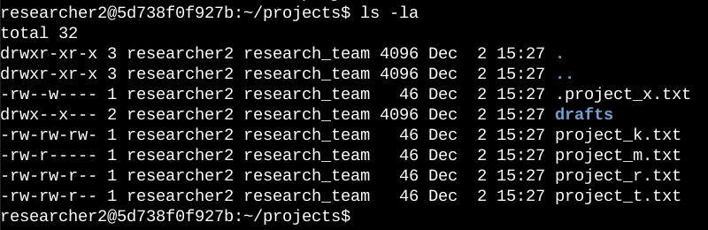
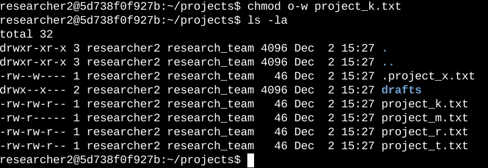
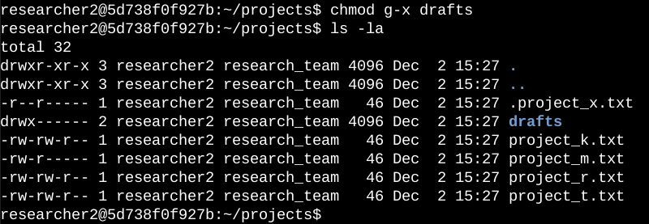

# Use Linux Commands to Manage File Permissions

This project focuses on checking and updating file and directory permissions in the `projects` directory for my organization’s research team. Some files had permissions that didn’t match what should be allowed, which could give the wrong people access. My goal was to review the current settings, adjust them where needed, and leave the system aligned with least privilege principles.

---

## Scenario
As part of regular system maintenance, I was asked to make sure all files and directories in the `projects` directory had the right permissions. This meant spotting anything unusual and fixing it so only the right people could read, write, or execute.

---

## Reviewing Permissions
I started with:

```bash
ls -la
```

This gave me a full list of contents, including hidden files, along with permissions, owners, and groups.  
From this, I saw:
- A directory named `drafts`
- A hidden file called `.project_x.txt`
- Several project files such as `project_k.txt` and `project_t.txt`

The permissions column made it easy to see who could do what.



---

## Adjusting Access

### Removing Write Access for Others
Policy says “others” should never have write permissions. I noticed `project_k.txt` didn’t follow that, so I ran:

```bash
chmod o-w project_k.txt
```

Another `ls -la` confirmed the change.



---

### Making an Archived File Read-Only
`.project_x.txt` had more permissions than needed. I removed write for both user and group, then explicitly gave group read access:

```bash
chmod u-w,g-w,g+r .project_x.txt
```

This locked the file down without removing access needed for review.


---

### Restricting Directory Access
The `drafts` directory should only be entered by `researcher2`. Group had execute permission, so I removed it:

```bash
chmod g-x drafts
```

This stopped anyone else from being able to open the folder.



---

## Summary
I used `ls -la` to audit the `projects` directory and applied targeted `chmod` changes to:
- Remove write for “others” on `project_k.txt`
- Make `.project_x.txt` read-only for user/group, add group read
- Remove group execute on `drafts`

These changes aligned the system with least privilege principles and reduced unnecessary access for the research team’s files.
